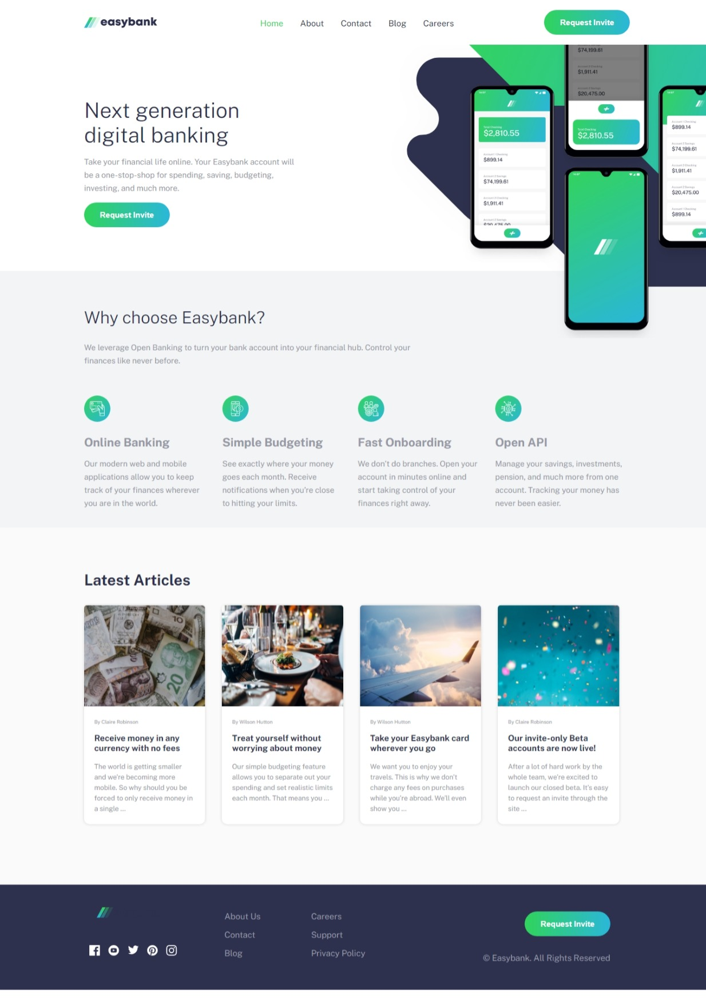

# Frontend Mentor - Easybank landing page solution

This is a solution to the [Easybank landing page challenge on Frontend Mentor](https://www.frontendmentor.io/challenges/news-homepage-H6SWTa1MFl). Frontend Mentor challenges help you improve your coding skills by building realistic projects. 

## Table of contents

- [Overview](#overview)
  - [The challenge](#the-challenge)
  - [Screenshot](#screenshot)
  - [Links](#links)
- [My process](#my-process)
  - [Built with](#built-with)
  - [What I learned](#what-i-learned)
  - [Continued development](#continued-development)
  - [Useful resources](#useful-resources)
- [Author](#author)

## Overview

### The challenge

Users should be able to:

- View the optimal layout for the interface depending on their device's screen size
- See hover and focus states for all interactive elements on the page

### Screenshot


.png)

### Links
## My process

### Built with

- Semantic HTML5 markup
- CSS custom properties
- Flexbox
- Mobile-first workflow
- javascripts
- [Styled Components](https://styled-components.com/) - For styles

### What I learned
i learned using javascript to toggle hamburger menu displays, which enhance the user experience of the website or web application by providing a seamless and intuitive navigation experience, especially on mobile devices or smaller screens.

To see how you can add code snippets, see below:

```html
     <div class="bttn" id="close-btn"><button class="items" id="btn">Request Invite</button></div>
```
```css
      #btn{
   background: linear-gradient(to left, hsl(192, 70%, 51%), hsl(136, 65%, 51%));
}
```js
 function toggleMenu() {
    var navContainer = document.getElementById('navContainer');
    navContainer.classList.toggle('hidden')
  }

### Continued development

i'd love to continue the mobile first approach to building webpages,it is faster and pages built with this approach tends to adjust faster to the change in screen size and also loads fastetr on mobile.

### Useful resources

- [Example resource 1]- This helped to correctly traverse through HTML elemwents using CSS and JavaScript.

## Author 

- git - [feranmygit](https://github.com/feranmygit)
- Frontend Mentor - [@feranmygit](https://www.frontendmentor.io/feranmygit)
- Twitter - [@Ozonegist](https://www.twitter.com/Ozonegist)

