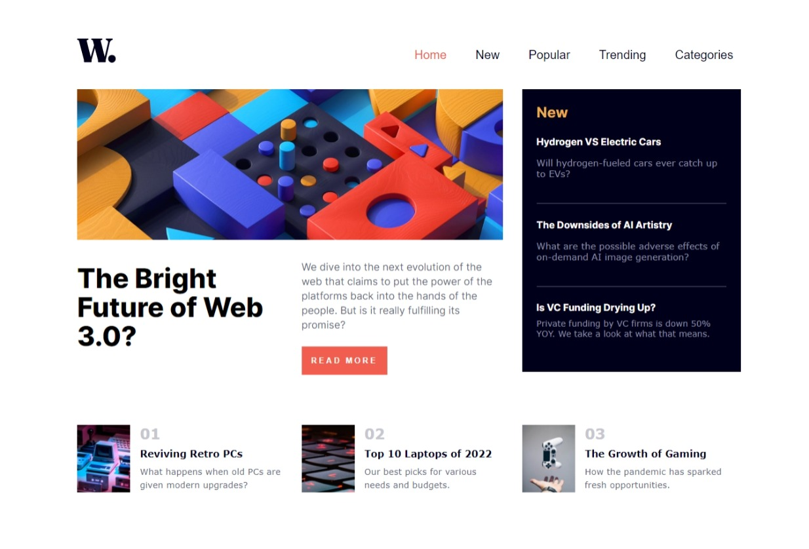

# Frontend Mentor - News homepage solution

This is a solution to the [News homepage challenge on Frontend Mentor](https://www.frontendmentor.io/challenges/news-homepage-H6SWTa1MFl). Frontend Mentor challenges help you improve your coding skills by building realistic projects. 

## Table of contents

- [Overview](#overview)
  - [The challenge](#the-challenge)
  - [Screenshot](#screenshot)
  - [Links](#links)
- [My process](#my-process)
  - [Built with](#built-with)
  - [What I learned](#what-i-learned)
  - [Continued development](#continued-development)
- [Author](#author)
- [Acknowledgments](#acknowledgments)


## Overview

### The challenge

Users should be able to:

- View the optimal layout for the interface depending on their device's screen size
- See hover and focus states for all interactive elements on the page

### Screenshot




### Links

- Solution URL: [frontendmentor](https://www.frontendmentor.io/feranmygit)
- Live Site URL: [Add live site URL here](https://your-live-site-url.com)

## My process

### Built with

- Semantic HTML5 markup
- CSS custom properties
- Flexbox
- CSS Grid
- Mobile-first workflow
- [Styled Components](https://styled-components.com/) - For styles

### What I learned
I tried to use css flexbox for the layout of the website but it was diffult to make the design as close as the figma desktop design. for this reason, I learned how I can possibly use css grid layout by sectioning my content which allows me to use and set each sections to a particular areas on grid template across desktop design.

Some interesting code snippets I used for this, see below:

```html
    <<input type="checkbox" name="input" id="input">
    <label for="input" class="container"> 
      <div class="hamburger-menu">
      <!-- Hamburger menu icon -->
      <div class="hamburger-icon"><div class="middle-line"></div></div>
      </div></div>
    </label>

    <main class="maincontainer">
    </main> 
```
```css
.maincontainer{
        display: grid;
        grid-template-areas: 'header header header header right right'
                             'menu menu main main right right'
                             'footer1 footer1 footer2 footer2 footer3 footer3';  

        gap: 2rem;
      }
```

### Continued development

i'd love to continue the mobile first approach to building webpages, it is faster and pages built with this approach tends to adjust faster to the change in screen size and also loads faster on mobile.
I want to continue to learn to know more about frontend development and very soon as a fullstack developer.

## Author

- git - [feranmygit](https://github.com/feranmygit)
- Frontend Mentor - [@feranmygit](https://www.frontendmentor.io/feranmygit)
- Twitter - [@Ozonegist](https://www.twitter.com/Ozonegist)

## Acknowledgments

All thanks to Mr Charlse my instructor who shaped my knowledge in understanding frontend development and to the entire Vnicom tech hub, which I'm beginiing to grow through. I pray may God through his unending mercy to stay with you forever. Amen 
